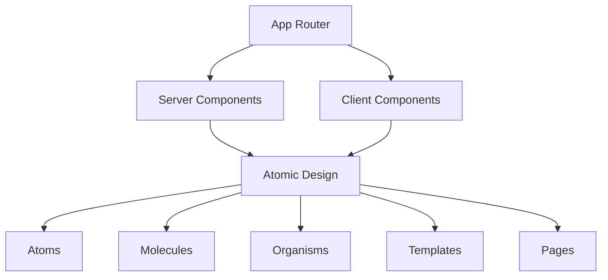

# Arquitectura del Sistema
## Visión General
Este proyecto utiliza **Next.js 14+ con App Router** implementando una arquitectura híbrida que combina Atomic Design con **Co-location Pattern** para crear una aplicación escalable y mantenible.
# Objetivos Arquitectónicos

- Escalabilidad: Fácil adición de nuevas funcionalidades
- Reutilización: Design system consistente y componentes modulares
- Mantenibilidad: Separación clara de responsabilidades
- Performance: Optimización automática con Server Components

# Stack Tecnológico

| Tecnología        | Versión  | Propósito                                              |
|------------------|-----------|---------------------------------------------------------|
| Next.js          | ^15.3.0   | Framework para React que permite renderizado SSR y SSG |
| React            | ^19.0.0   | Librería para construir interfaces de usuario          |
| Material-UI      | ^7.0.2    | Librería de componentes UI con diseño moderno          |
| React Hook Form  | ^7.54.2   | Manejo eficiente y validación de formularios           |
| TypeScript       | ^5        | Superset de JavaScript con tipado estático             |



# Patrones de Diseño Implementados
## 1. App Router Pattern (Next.js 14)
Utilizamos la nueva estructura de App Router con archivos especiales co-ubicados:
```mermaid
app/
├── layout.tsx                 # Root layout
├── page.tsx                   # Home page
├── dashboard/
│   ├── layout.tsx            # Dashboard layout
│   ├── users/
│   │   ├── page.tsx          # Users page
│   │   ├── loading.tsx       # Loading UI
│   │   ├── error.tsx         # Error boundary
│   │   ├── not-found.tsx     # 404 page
│   │   └── components/       # Route-specific components
│   │       ├── UserListTemplate.tsx
│   │       └── UserTableOrganism.tsx
│   └── api/
│       └── users/
│           └── route.ts      # API endpoints
```
# 2. Atomic Design System
Implementamos Atomic Design para crear un sistema de componentes escalable:

# 3. Co-location Pattern
Principio: Los archivos relacionados viven cerca unos de otros.
Componentes Globales (Design System)
```mermaid
components/
├── atoms/
├── molecules/
├── organisms/
└── templates/
Componentes Específicos de Ruta
app/dashboard/users/components/
├── UserListTemplate.tsx      # Template específico
├── UserTableOrganism.tsx     # Organism específico
└── UserStatsCards.tsx        # Molecule específico
```
# Criterio de decisión:

- Global: Componente reutilizable en múltiples páginas
- Local: Componente específico para una funcionalidad/ruta

# 4. Server Components vs Client Components
Server Components (por defecto):

Páginas principales
Componentes que consumen APIs
Templates y layouts estáticos

Client Components ('use client'):

Componentes con interactividad (onClick, useState)
Formularios con validación en tiempo real
Componentes que usan hooks del navegador

Estructura de Directorios
```mermaid
proyecto/
├── app/                      # App Router (Next.js 14)
│   ├── globals.css
│   ├── layout.tsx
│   ├── page.tsx
│   ├── (auth)/              # Route group
│   │   ├── login/
│   │   └── register/
│   ├── dashboard/
│   │   ├── layout.tsx
│   │   ├── users/
│   │   ├── settings/
│   │   └── api/
│   └── api/
├── components/              # Design System Global
│   ├── atoms/
│   ├── molecules/
│   ├── organisms/
│   └── templates/
├── lib/                     # Utilities y helpers
├── hooks/                   # Custom hooks reutilizables
├── types/                   # TypeScript types
└── docs/                    # Documentación
```

# Flujo de Datos

- **Usuario** interactúa con la página
- **Page** Component recibe la request
- **Server** Component obtiene datos (si es necesario)
- **Template** estructura la página
- **Organisms** renderizan secciones complejas
- **Molecules** y Atoms componen la UI final

# Consideraciones de Performance

- **Server Components**: Renderizado en servidor por defecto
- **Streaming**: Loading states automáticos con loading.tsx
- **Code Splitting**: Automático por rutas
- **Lazy Loading**: Componentes pesados bajo demanda ( componente grande (por ejemplo, un gráfico o editor de texto), puedes cargarlo sólo cuando sea necesario usando dynamic() de Next.js.)

# Escalabilidad
## Agregar nueva funcionalidad

1. Crear nueva ruta en /app
2. Reutilizar componentes del design system
3. Crear componentes específicos solo si es necesario
4. Co-ubicar archivos relacionados

## Mantener consistencia

1. Todos los atoms siguen las mismas props interfaces
2. Design tokens centralizados (colores, spacing, typography)
3. Naming conventions consistentes
4. TypeScript para type safety

## Convenciones de Naming

1. Atoms: Button.tsx, Input.tsx
2. Molecules: SearchBar.tsx, UserCard.tsx
3. Organisms: Header.tsx, UserList.tsx
4. Templates: DashboardTemplate.tsx
5. Pages: page.tsx (App Router convention)

## Futuras Consideraciones

1. Storybook: Para documentar componentes del design system
2. Testing: Jest + Testing Library para componentes
3. Design Tokens: Centralizar variables de diseño
4. Performance Monitoring: Métricas de componentes
