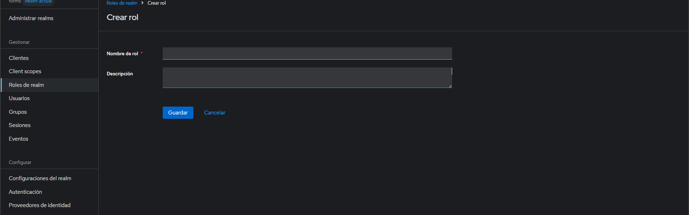
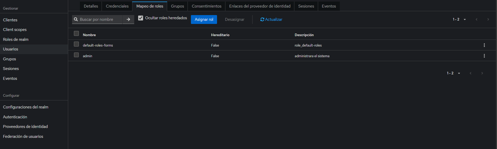
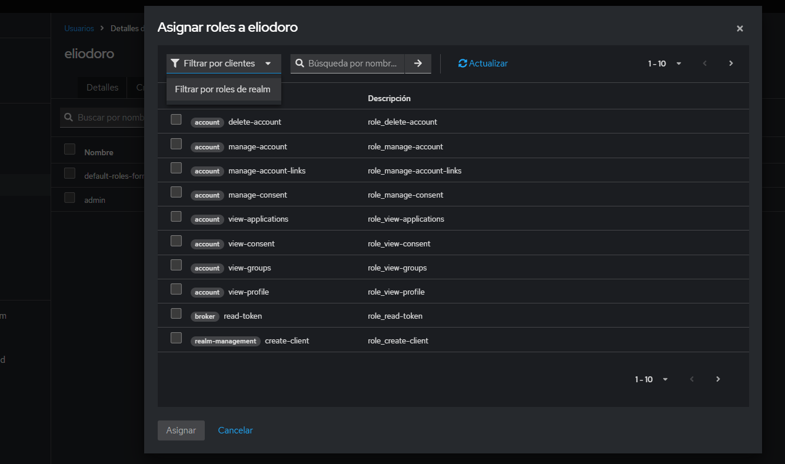
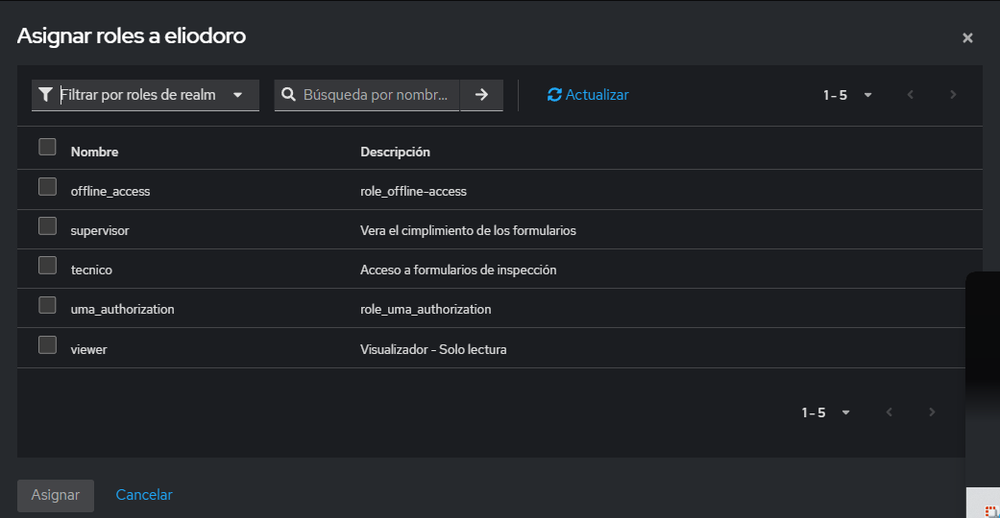

Creacion de roles en keycloack 

asignacion de roles a un usuario en keycloack 
primero vamos a usuario y seleccionamos el usuario 

y luego en mapeo de roles en asignar roles y filtrar por roles de realm 

y se tiene lo siguiente
 