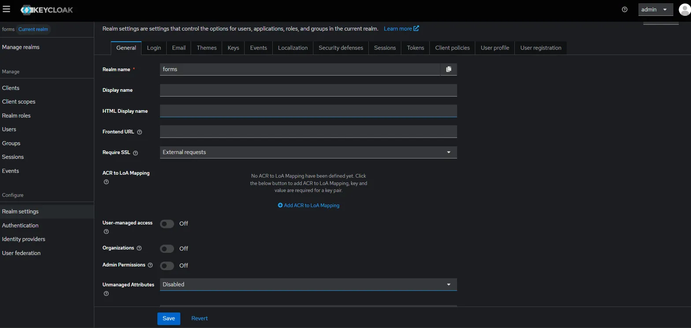
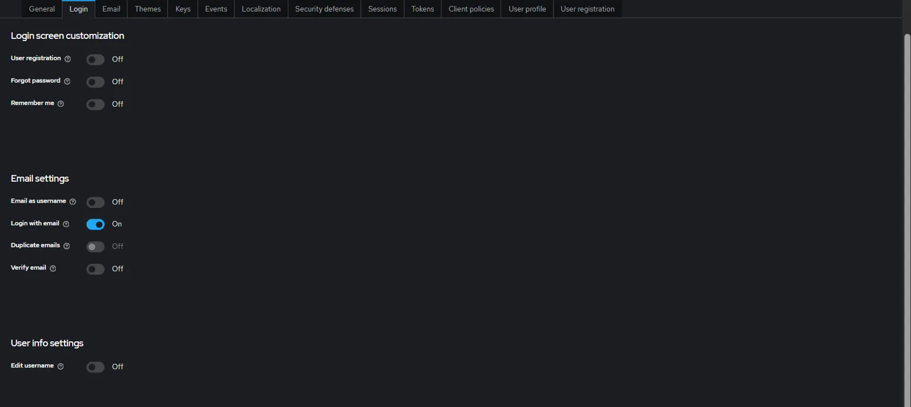
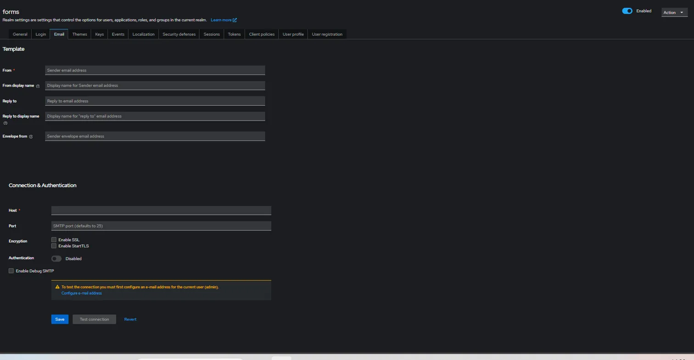
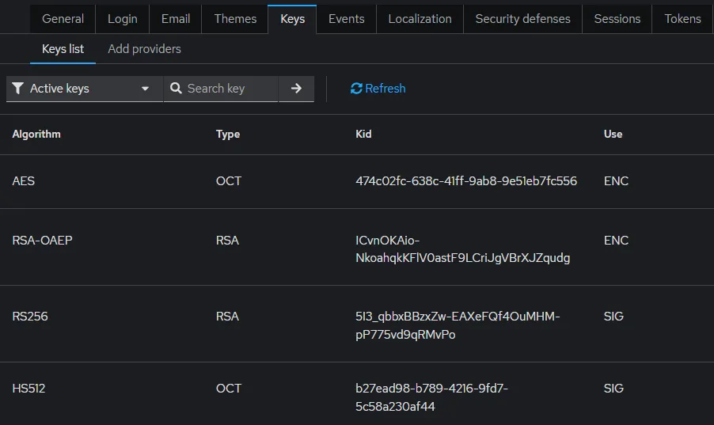
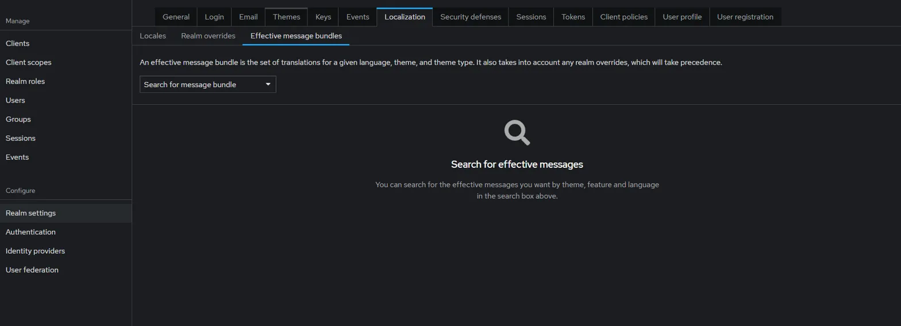
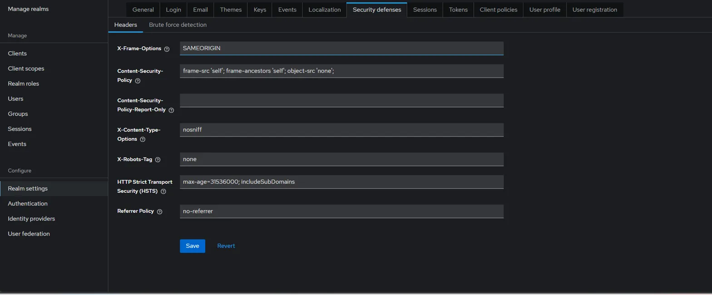
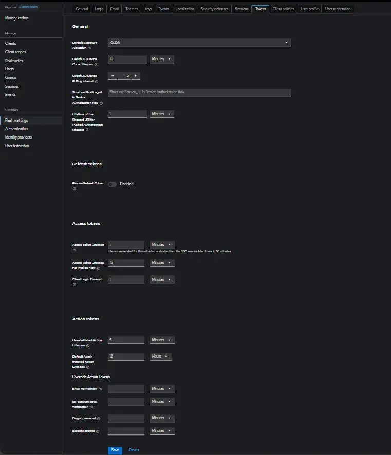
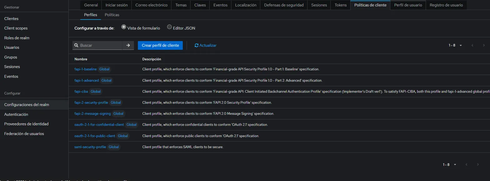
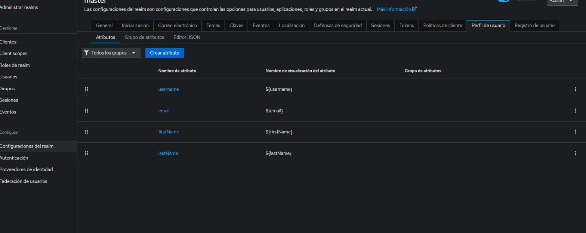
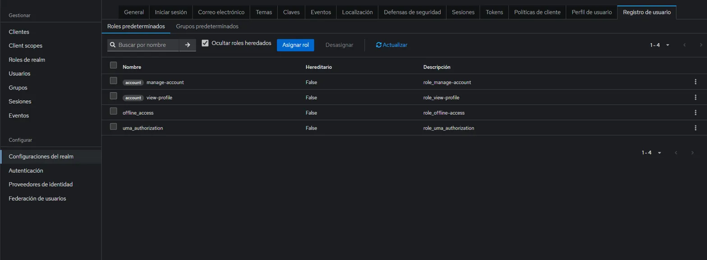

# Que configuraciones realice 
 estaba en on

en user Profile  entraste al atributo email y cambiaste lo siguiente


# Aprendiendo Keycloack 
# Configuración del Realm en Keycloak

Este documento explica cada sección importante dentro de la configuración de un Realm en Keycloak, usando como ejemplo el realm llamado `"forms"`.

---

## 🧾 Información General del Realm

- **Realm name**: `forms`  
  Es el identificador único del realm. **No se puede cambiar después de crearlo**.

- **Display name**: _(Campo vacío)_  
  Nombre que se mostrará a los usuarios en interfaces públicas.

- **HTML Display name**: _(Campo vacío)_  
  Permite usar HTML para formatear el nombre que ven los usuarios (útil para personalización visual).

---

## 🔐 Configuración de Acceso

- **Frontend URL**: _(Campo vacío)_  
  Define la URL base que los clientes externos utilizarán para acceder al realm.

- **Require SSL**: `External requests`  
  Las conexiones SSL/HTTPS son obligatorias **solo para peticiones externas** (no para conexiones internas como `localhost`).

---

## 🔁 Mapeo ACR to LoA

- **ACR to LoA Mapping**: _(No configurado)_  
  El **ACR (Authentication Context Class Reference)** permite mapear niveles de autenticación (LoA - Level of Assurance).  
  Se utiliza para definir la **fuerza requerida en la autenticación** según el contexto.

---

## 🛡️ Configuraciones de Seguridad (Desactivadas)

- **User-managed access**: `OFF`  
  Los usuarios **no pueden gestionar sus propios permisos de acceso a recursos**.

- **Organizations**: `OFF`  
  No se activa la funcionalidad de organizaciones para agrupar usuarios bajo una estructura jerárquica.

- **Admin Permissions**: `OFF`  
  No se requieren permisos especiales de administrador para realizar ciertas operaciones internas.

---

## 🧬 Atributos No Gestionados

- **Unmanaged Attributes**: `Disabled`  
  Los atributos de usuario que **no estén definidos en el esquema** no serán permitidos.

---

> 📌 **Nota**: Esta configuración inicial es útil para entornos de desarrollo o prueba. En producción, se recomienda revisar especialmente la política de SSL y los permisos de administración.


# Guía de Configuración de un Realm en Keycloak para Producción

Esta guía cubre las configuraciones clave de un Realm en Keycloak, con recomendaciones específicas para entornos de **desarrollo**, **staging** y **producción**.

---

## 🔧 Configuración General

### Realm Name
- **Ejemplo producción**: `company-prod`, `app-production`
- **Buenas prácticas**:
  - Usar nombres descriptivos
  - Sin espacios
  - Usar guiones bajos (`_`) o medios (`-`)

### Display Name
- **Ejemplo**: `"Sistema de Gestión Empresarial"`
- **Uso**: Se muestra en páginas de login y en correos electrónicos.

### HTML Display Name
- **Ejemplo**: ` Mi Aplicación`
- **Uso**: Permite agregar formato HTML o logos personalizados en la interfaz pública.

### Frontend URL
- **Crítico en producción**: `https://auth.tudominio.com`
- **Por qué**: Define la URL base externa que verán los usuarios y clientes.

---

## 🔒 Configuración de SSL

### Require SSL
- **Desarrollo**: `External requests`
- **Staging**: `External requests`
- **Producción**: `All requests` ✅ (Obligatorio)

---

## 🛡️ Configuraciones de Seguridad Avanzadas

### User-managed Access (UMA)
- **Activar si**: Los usuarios necesitan compartir recursos entre sí.  
  _Ejemplo_: Compartir archivos en un sistema de documentos.
- **Desactivar si**: Solo se requiere autenticación básica.

### Organizations
- **Activar si**: Gestionas múltiples empresas o departamentos.
  _Ejemplo_: SaaS multitenancy con usuarios por organización.
- **Beneficio**: Aislamiento de datos por organización.

### Admin Permissions
- **Activar si**: Requieres control granular de permisos administrativos.
- **Permite**: Definir qué administradores pueden realizar acciones específicas.

---

## 🔄 Atributos No Gestionados

### ¿Qué son?
Definen cómo se tratan los atributos de usuario **no definidos en el esquema oficial**.

### Opciones:
- `Disabled` ✅ (**Recomendado en producción**)
  - Mayor control y seguridad
  - Previene inyección de atributos no deseados
  - Esquema de datos más limpio
- `Enabled` (Para desarrollo o integración rápida)
  - Permite atributos dinámicos
  - Ideal para sistemas legacy o prototipos
- `Read Only`
  - Solo lectura de atributos no definidos

---

## 🔐 Algoritmo de Firma (SAML IdP Metadata)

### ¿Para qué sirve?
Define el algoritmo de firma usado cuando Keycloak actúa como proveedor de identidad (IdP) con SAML.

### Opciones comunes:
- `RSA_SHA256` ✅ (Recomendado)
- `RSA_SHA512` (Más seguro, ideal para producción)
- `RSA_SHA1` ❌ (Obsoleto, evitar)
- `DSA_SHA1` ❌ (Obsoleto, evitar)

### Cuándo configurarlo:
- Solo si estás utilizando SAML.
- Keycloak es tu Identity Provider (IdP).
- Integración con aplicaciones empresariales.

---

## 🔗 Endpoints del Realm

### OpenID Endpoint Configuration
- **URL**: `https://tu-keycloak.com/realms/forms/.well-known/openid-configuration`
- **Propósito**: Proporciona metadatos OpenID Connect para los clientes.
- **Incluye**:
  - URLs de autorización
  - URLs de token
  - Algoritmos soportados
  - Scopes disponibles

### SAML 2.0 Identity Provider Metadata
- **URL**: `https://tu-keycloak.com/realms/forms/protocol/saml/descriptor`
- **Propósito**: Metadatos SAML para aplicaciones compatibles.
- **Incluye**:
  - Certificados públicos
  - Endpoints SAML
  - Métodos de binding soportados

---

## 📋 Configuraciones Recomendadas por Ambiente

| Ambiente     | Unmanaged Attributes | Signature Algorithm | Endpoints |
|--------------|----------------------|----------------------|-----------|
| Desarrollo   | Enabled              | RSA_SHA256           | HTTP (pruebas locales) |
| Staging      | Read Only            | RSA_SHA256           | HTTPS obligatorio      |
| Producción   | Disabled ✅           | RSA_SHA512 ✅         | HTTPS con certificados válidos ✅ |

---

> 📘 **Sugerencia final**: Antes de pasar a producción, verifica cuidadosamente la política de SSL, los endpoints públicos y revisa los atributos personalizados. Keycloak es muy potente, pero requiere una configuración rigurosa para asegurar su uso seguro en entornos reales.


# Configuración de la Pestaña "Login" en Keycloak

Esta sección detalla las configuraciones disponibles en la pestaña **Login** de Keycloak y sus implicancias para distintos entornos, especialmente producción.

---

## 🖥️ Personalización de Pantalla de Login

### 🔹 User Registration (Actualmente: OFF)
- **¿Qué hace?**  
  Permite a nuevos usuarios registrarse desde la pantalla de login.

- **OFF**: Solo los administradores pueden crear cuentas.  
- **ON**: Cualquier persona puede registrarse.

#### Producción:
- ✅ Activar si: Es una aplicación pública (SaaS, ecommerce).
- ❌ Desactivar si: Es un sistema interno empresarial.
- ⚠️ Considera: Añadir CAPTCHA y verificación de email si se activa.

---

### 🔹 Forgot Password (Actualmente: OFF)
- **¿Qué hace?**  
  Muestra el enlace "¿Olvidaste tu contraseña?" en el login.

- **Requiere**: Configurar servidor de email (pestaña Email).

#### Producción:
- ✅ Casi siempre ON: Los usuarios necesitan recuperar sus contraseñas.
- ⚠️ Debes configurar SMTP en la pestaña Email primero.

---

### 🔹 Remember Me (Actualmente: OFF)
- **¿Qué hace?**  
  Permite al usuario mantener su sesión iniciada más tiempo mediante un checkbox.

- **Beneficio**: Mejor experiencia de usuario.  
- **Riesgo**: Sesiones prolongadas en dispositivos compartidos.

#### Producción:
- ✅ ON para aplicaciones web públicas.  
- ❌ OFF para aplicaciones críticas (banca, salud, datos sensibles).

---

## 📧 Configuración de Email

### 🔹 Email as Username (Actualmente: OFF)
- **¿Qué hace?**  
  Obliga a los usuarios a usar su email como nombre de usuario.

- **Ventaja**: Los usuarios recuerdan mejor su correo.  
- **Desventaja**: El email puede cambiar.

---

### 🔹 Login with Email (Actualmente: ON) ✅
- **¿Qué hace?**  
  Permite el login tanto con email como con username.

- ✅ **Recomendado para la mayoría de los casos.**

---

### 🔹 Duplicate Emails (Actualmente: OFF)
- **¿Qué hace?**  
  Permite que varios usuarios tengan el mismo correo.

#### Producción:
- ❌ Mantener OFF para asegurar unicidad y trazabilidad.

---

### 🔹 Verify Email (Actualmente: OFF)
- **¿Qué hace?**  
  Requiere que el usuario verifique su email antes de usar su cuenta.

#### Producción:
- ✅ Activar para mayor seguridad.  
- ⚠️ Requiere configuración SMTP activa.

---

## 👤 Configuración de Información de Usuario

### 🔹 Edit Username (Actualmente: OFF)
- **¿Qué hace?**  
  Permite que los usuarios editen su nombre de usuario después del registro.

#### Producción:
- ❌ Generalmente OFF para mantener la estabilidad en la identidad del usuario.

---

## ✅ Configuración Recomendada para Producción

### 🔸 Sistema Interno Empresarial
- User registration: OFF  
- Forgot password: ON  
- Remember me: OFF  
- Email as username: OFF  
- Login with email: ON  
- Duplicate emails: OFF  
- Verify email: ON  
- Edit username: OFF  

---

### 🔸 Aplicación SaaS Pública
- User registration: ON  
- Forgot password: ON  
- Remember me: ON  
- Email as username: ON  
- Login with email: ON  
- Duplicate emails: OFF  
- Verify email: ON  
- Edit username: OFF  

---

### 🔸 Aplicación de Alta Seguridad
- User registration: OFF  
- Forgot password: ON  
- Remember me: OFF  
- Email as username: OFF  
- Login with email: OFF  
- Duplicate emails: OFF  
- Verify email: ON  
- Edit username: OFF  

---

## ⚠️ Configuraciones Críticas para Activar

### 1. Forgot Password
Antes de activarlo:
- Ir a la pestaña **Email**
- Configurar servidor SMTP
- Probar envío de correos
- Personalizar templates de email

---

### 2. Verify Email
Antes de activarlo:
- Configurar SMTP
- Probar envío de verificación
- Definir flujo de onboarding
- Preparar soporte para usuarios

---

### 3. User Registration
Antes de activarlo:
- Configurar términos y condiciones
- Añadir CAPTCHA (defensas contra bots)
- Personalizar formulario de registro
- Asignar roles por defecto

---

## 🚨 Consideraciones de Seguridad

### 🔹 Remember Me - Riesgos
- Sesiones muy largas
- Dispositivos compartidos
- Tokens robados válidos por más tiempo

### 🔹 User Registration - Riesgos
- Creación masiva de cuentas falsas (spam)
- Ataques de enumeración de usuarios
- Consumo innecesario de recursos

### 🔹 Buenas Prácticas con Emails
- Siempre verificar el email del usuario
- En producción, un correo = una cuenta
- Registrar cambios de email para trazabilidad

---

> 💡 **Consejo**: Mantén activas solo las configuraciones necesarias para el caso de uso real. En producción, prioriza seguridad sin sacrificar usabilidad crítica.


# Configuración de la Pestaña "Email" en Keycloak

La configuración de email en Keycloak es crítica para entornos de **producción**, ya que permite enviar correos para recuperación de contraseña, verificación de cuenta, notificaciones, entre otros.

---

## 📧 Configuración del Remitente (Template)

### 🔹 From (Obligatorio)
- **¿Qué es?**  
  Dirección de correo que aparecerá como remitente.
- **Ejemplo**: `noreply@tuempresa.com`, `sistema@tudominio.com`
- ✅ **Producción**: Usar dominio propio (no Gmail/Yahoo).

---

### 🔹 From Display Name
- **¿Qué es?**  
  Nombre amigable que verán los usuarios como remitente.
- **Ejemplo**: `"Sistema de Autenticación"`, `"Mi Aplicación"`
- ✅ **Beneficio**: Apariencia más profesional.

---

### 🔹 Reply To
- **¿Qué es?**  
  Correo al que se enviarán las respuestas (si es diferente del `From`).
- **Ejemplo**: `soporte@tuempresa.com`

---

### 🔹 Reply To Display Name
- **¿Qué es?**  
  Nombre que verán los usuarios en la dirección de respuesta.
- **Ejemplo**: `"Soporte Técnico"`

---

### 🔹 Envelope From
- **¿Qué es?**  
  Dirección técnica para protocolos SMTP (manejo de rebotes).
- **Uso**: Avanzado. Si no se configura, se usa el campo `From`.

---

## 🔌 Conexión y Autenticación (SMTP)

### 🔹 Host (Obligatorio)
- **¿Qué es?**  
  Servidor SMTP para enviar emails.
- **Ejemplos comunes**:
  - Gmail: `smtp.gmail.com`
  - Outlook: `smtp-mail.outlook.com`
  - SendGrid: `smtp.sendgrid.net`
  - Amazon SES: `email-smtp.us-east-1.amazonaws.com`

---

### 🔹 Port
- **¿Qué es?**  
  Puerto utilizado para la conexión SMTP.
- **Puertos comunes**:
  - `587`: STARTTLS ✅ (recomendado)
  - `465`: SSL/TLS
  - `25`: Sin cifrado ❌ (no usar en producción)

---

### 🔹 Encryption
- `Enable SSL`: Puerto `465`, cifrado desde el inicio.
- `Enable StartTLS`: Puerto `587`, inicia sin cifrar y luego negocia cifrado.
- ✅ **Producción**: Activar **una de las dos opciones**.

---

### 🔹 Authentication
- `Disabled`: Sin autenticación (solo para servidores internos).
- `Enabled`: Requiere usuario y contraseña (✅ mayoría de casos).

---

### 🔹 Enable Debug SMTP
- **¿Qué hace?**  
  Activa logs detallados para debugging SMTP.
- ⚠️ **Producción**: Activar solo temporalmente para pruebas.

---

## 🎯 Configuraciones por Proveedor

### 📤 Gmail / Google Workspace
- Host: `smtp.gmail.com`
- Port: `587`
- Encryption: ✅ Enable StartTLS
- Authentication: ✅ Enabled
- Usuario: `tucuenta@gmail.com`
- Contraseña: **App Password** (no tu contraseña normal)

---

### 📤 Microsoft 365 / Outlook
- Host: `smtp-mail.outlook.com`
- Port: `587`
- Encryption: ✅ Enable StartTLS
- Authentication: ✅ Enabled
- Usuario: `tucuenta@outlook.com`
- Contraseña: Contraseña de la cuenta (o configurar OAuth2)

---

### 📤 Amazon SES
- Host: `email-smtp.us-east-1.amazonaws.com`
- Port: `587`
- Encryption: ✅ Enable StartTLS
- Authentication: ✅ Enabled
- Usuario: SMTP Username (generado en AWS)
- Contraseña: SMTP Password (generado en AWS)

---

### 📤 SendGrid
- Host: `smtp.sendgrid.net`
- Port: `587`
- Encryption: ✅ Enable StartTLS
- Authentication: ✅ Enabled
- Usuario: `apikey`
- Contraseña: Tu API Key generada en SendGrid

---

## 🚨 Recomendaciones para Producción

### Opción 1: Servicio Profesional (Recomendado)
- ✅ Proveedor: Amazon SES, SendGrid, Mailgun
- ✅ From: `noreply@tudominio.com`
- ✅ From display name: `"Tu Aplicación"`
- ✅ Reply to: `soporte@tudominio.com`
- ✅ Port: `587`
- ✅ StartTLS: Enabled
- ✅ Authentication: Enabled

---

### Opción 2: Google Workspace
- Host: `smtp.gmail.com`
- Port: `587`
- StartTLS: ✅ Enabled
- From: `sistema@tuempresa.com`
- Contraseña: **App Password** (necesita 2FA activado)

---

## ⚠️ Problemas Comunes y Soluciones

### ❗ Gmail – "Less secure apps"
- **Problema**: Gmail bloquea conexiones de apps menos seguras.
- **Solución**: Usar App Passwords.
- **Pasos**:
  1. Activar 2FA en Gmail.
  2. Generar App Password.
  3. Usar App Password en lugar de tu contraseña normal.

---

### ❗ Outlook – Autenticación moderna
- **Problema**: Microsoft cambió su sistema de autenticación.
- **Solución**:
  - Usar OAuth2 o SMTP AUTH básico.
  - Alternativa: Microsoft Graph API para envío.

---

### ❗ Emails no llegan
- Verifica:
  - Configuración de DNS (SPF, DKIM, DMARC)
  - Logs en Keycloak y servidor SMTP
  - Que el email no llegue a **spam**
- Usa el botón **Test Connection** en Keycloak

---

## 🔍 Testing y Troubleshooting

### Antes de producción:
- ✅ Usar el botón **Test connection**
- ✅ Enviar email real a usuario de prueba
- ✅ Verificar logs de errores SMTP
- ✅ Comprobar spam/correos no entregados

### Configurar usuario administrador:
- ⚠️ **Importante**: Agregar email válido al admin
  - Ir a: `Users > admin`
  - Asignar un correo real
  - Permite pruebas reales y recuperación de acceso

---

> 💡 **Consejo final**: Siempre prueba exhaustivamente la configuración de email antes de habilitar funciones como "Forgot Password" o "Verify Email" en producción.


# Configuración de la Pestaña "Keys" en Keycloak

La sección **Keys** de Keycloak gestiona las claves criptográficas fundamentales para la seguridad del sistema: firma de tokens, cifrado y autenticación entre servicios.

---

## 🔐 ¿Qué son las Keys en Keycloak?

Keycloak utiliza claves criptográficas para:

- Firmar **JWT tokens** (`access_token`, `id_token`)
- Cifrar datos sensibles
- Verificar integridad de los tokens
- Autenticación segura entre servicios y aplicaciones

---

## 📋 Análisis de tus Keys Actuales

### 1. **AES**
- **ID**: `474c02fc-638c-41ff-9ab8-9e51eb7fc556`
- **Algoritmo**: `AES (Advanced Encryption Standard)`
- **Tipo**: `OCT` (clave simétrica)
- **Uso**: `ENC` (Encryption)
- **Propósito**: Cifrado de datos sensibles como *refresh tokens*

---

### 2. **RSA-OAEP**
- **ID**: `JCvnOKAip-Nkoahq...`
- **Algoritmo**: `RSA-OAEP`
- **Tipo**: `RSA` (clave asimétrica)
- **Uso**: `ENC`
- **Propósito**: Cifrado de datos con clave pública/privada

---

### 3. **RS256**
- **ID**: `513_qbbxBBzxZw-EAXe...`
- **Algoritmo**: `RSA-SHA256`
- **Tipo**: `RSA`
- **Uso**: `SIG` (Signature)
- **Propósito**: **Firma los JWT tokens** (clave más crítica)

---

### 4. **HS512**
- **ID**: `b27ead98-b789-4216...`
- **Algoritmo**: `HMAC-SHA512`
- **Tipo**: `OCT`
- **Uso**: `SIG`
- **Propósito**: Firma alternativa con HMAC (menos común)

---

## 🎯 Importancia de Cada Key

### 🔸 RS256 – La más crítica
- Firma **todos los JWT tokens**
- **Clave pública**: Usada por aplicaciones para verificar tokens
- **Clave privada**: Solo Keycloak la conoce
- ⚠️ Si se compromete: Todos los tokens son vulnerables

---

### 🔸 AES – Para datos sensibles
- Uso: Cifrado de `refresh_tokens` y datos internos
- ⚠️ Clave simétrica: debe protegerse adecuadamente

---

### 🔸 RSA-OAEP – Cifrado asimétrico
- Ventaja: Seguridad sin compartir claves secretas
- Uso: Cifrado de datos grandes o complejos

---

## ⚙️ Configuraciones Importantes

### 🔹 Active Keys vs All Keys
- **Active**: Claves actualmente en uso
- **All**: Incluye activas, deshabilitadas y antiguas
- 🔄 **Rotación**: Keycloak conserva keys antiguas para verificar tokens emitidos anteriormente

---

### 🔹 Add Providers (Agregar Proveedores de Claves)
Permite definir nuevas claves criptográficas.

Tipos de proveedores:

- ✅ **Generated keys**: Keycloak las genera automáticamente
- ✅ **Imported keys**: Importadas desde archivo
- ✅ **External keys**: Usadas desde HSM, Vault, etc.

---

## 🔒 Mejores Prácticas para Producción

### 1. 🔁 Rotación de Keys
- ✅ Configurar **rotación automática**
- ✅ Período recomendado: **cada 90 días**
- ✅ Conservar keys antiguas temporalmente
- ✅ Monitorear expiración con alertas

---

### 2. ✅ Algoritmos Recomendados
- `RS256`: Estándar de industria
- `RS512`: Más seguro, ideal en producción
- ❌ `HS256`: Solo en casos específicos
- ❌ `RS1`, `HS1`: **Obsoletos**

---

### 3. 🧠 Tamaño de Claves
- `RSA`: Mínimo **2048 bits** (ideal: **4096** bits)
- `AES`: **256 bits**
- `ECDSA`: Curvas `P-256` o superiores

---

### 4. 🛡️ Almacenamiento Seguro
- ✅ Usar **HSM** (Hardware Security Module)
- ✅ Integrar con **Vault** (HashiCorp, AWS KMS, etc.)
- ✅ Realizar **backups cifrados**
- ✅ Control estricto de acceso

---

## 🚨 Configuración por Ambiente

| Ambiente    | Claves                | Rotación     | Seguridad |
|-------------|-----------------------|--------------|-----------|
| Desarrollo  | Generadas automáticamente ✅ | Manual        | Tamaño estándar |
| Staging     | Similares a producción | Automática ✅ | Testing activo |
| Producción  | HSM / Vault recomendado ✅ | Automática cada 90 días ✅ | 4096 bits, backup y monitoreo ✅ |

---

## ⚠️ Señales de Alarma

### 🔸 Keys Comprometidas
- Tokens válidos de usuarios desconocidos
- Actividad anómala en logs
- Claves filtradas en código/repositorios

---

### 🔸 Keys Expirando
- Tokens empiezan a fallar
- Errores de verificación
- Aplicaciones no pueden validar tokens

---

## 🔧 Acciones Recomendadas

### Para tu configuración actual:
- ✅ Apta para **desarrollo**
- 🛠️ Para producción:
  - Considera usar un provider **externo**
  - Configura **rotación automática**
  - Activa monitoreo y alertas de expiración
  - Realiza **backups cifrados** de claves críticas

---

### Próximos pasos sugeridos:
1. Configurar **rotación automática**
2. Definir política de **Key Management**
3. Implementar **monitoreo**
4. Planificar **disaster recovery** para claves

---

> 🔐 **Consejo final**: La seguridad de tus claves define la seguridad de todo tu sistema de autenticación. En producción, trátalas como el activo más crítico de tu infraestructura.
# 🔧 Key Providers en Keycloak

Los **Key Providers** permiten generar, importar o conectar claves criptográficas desde fuentes externas. Son fundamentales para asegurar la firma, cifrado y rotación de claves en entornos seguros.

---

## 📋 Tipos de Key Providers Disponibles

### 1. 🔐 RSA Generated
- **¿Qué es?**: Keycloak genera claves RSA automáticamente.
- **Uso**: Firma de JWT tokens (`RS256`, `RS384`, `RS512`).
- **Parámetros**:
  - `Key size`: 2048 o 4096 bits
  - `Algorithm`: RS256 (recomendado)
  - `Priority`: 100 (más alta prioridad)
  - `Active`: Yes/No

---

### 2. 🧮 ECDSA Generated
- **¿Qué es?**: Claves de curva elíptica (más eficientes).
- **Ventajas**: Menor tamaño, igual seguridad.
- **Algoritmos**: `ES256`, `ES384`, `ES512`.
- **Uso recomendado**: Aplicaciones móviles.

---

### 3. 🔐 HMAC Generated
- **¿Qué es?**: Claves simétricas HMAC.
- **Algoritmos**: `HS256`, `HS384`, `HS512`.
- **Uso**: Casos específicos donde se comparte clave secreta.

---

### 4. 🔐 AES Generated
- **¿Qué es?**: Claves para cifrado simétrico.
- **Uso**: Cifrar *refresh tokens* y otros datos internos.
- **Tamaño**: 128, 192 o 256 bits.

---

## 🏢 Proveedores Externos (Producción)

### 5. 🗝️ RSA Key from Java Keystore
- **¿Qué es?**: Importar claves desde `.jks`.
- **Uso**: Migración desde sistemas existentes.
- **Configuración**:
  - `Keystore path`
  - `Keystore password`
  - `Key alias`
  - `Key password`

---

### 6. 🛡️ Vault Key Provider (HashiCorp Vault)
- **¿Qué es?**: Integra Keycloak con Vault.
- **Ventajas**:
  - Rotación automática
  - Gestión centralizada de secretos
  - Auditoría y control de acceso
- **Configuración**:
  - `Vault URL`
  - `Vault path`
  - `Auth Method`: AppRole, Token, etc.

---

### 7. 🔗 External RSA Key
- **¿Qué es?**: Usar claves externas (formato `PEM`, `PKCS#8`).
- **Uso**: Cuando las claves se generan y gestionan externamente.

---

## 🎯 Configuración Paso a Paso

### Agregar un RSA Generated Provider
1. Clic en `Add Providers`
2. Seleccionar `rsa-generated`
3. Configurar:
   - `Name`: rsa-production-2024
   - `Priority`: 100
   - `Enabled`: ON
   - `Active`: ON
   - `Algorithm`: RS256
   - `Key size`: 4096
4. Click en `Save`

---

### Configurar Rotación Automática
En el provider creado, configura:
- ✅ `Auto-rotation`: Enabled
- ✅ `Rotation period`: 90 days
- ✅ `Keep old keys`: 30 days

---

## 🔒 Configuraciones Avanzadas

### 🛡️ Vault Integration (Recomendado para Producción)

```bash
# 1. Habilitar AppRole en Vault
vault auth enable approle

# 2. Crear política de acceso
vault policy write keycloak-policy - <<EOF
path "secret/data/keycloak/*" {
  capabilities = ["create", "read", "update", "delete", "list"]
}
EOF

# 3. Crear un role
vault write auth/approle/role/keycloak \
  policies="keycloak-policy" \
  token_ttl=1h \
  token_max_ttl=4h



# 🌍 Localization en Keycloak

Keycloak permite mostrar su interfaz (login, registro, errores, etc.) en distintos idiomas, mejorando la experiencia del usuario y permitiendo personalizaciones específicas por región o empresa.

---

## 🧩 Componentes del Sistema de Localización

### 1. 🗣️ Locales (Idiomas Disponibles)
- Define los idiomas disponibles en tu **realm**
- Soporte nativo para múltiples idiomas
- Se pueden agregar idiomas personalizados

### 2. 📝 Realm Overrides
- Sobrescribe los mensajes predeterminados de Keycloak
- Ideal para branding, términos legales, mensajes corporativos

### 3. 📦 Effective Message Bundles
- Muestra el resultado combinado de traducciones por defecto + personalizaciones
- Útil para búsqueda y verificación de mensajes específicos

---

## ⚙️ Configuración Detallada

### ✅ Locales

**Configuraciones típicas**:

```yaml
Supported Locales:
  - en (English)
  - es (Español)
  - fr (Français)
  - de (Deutsch)
  - pt-BR (Português Brasil)

Default Locale: es

Internationalization Enabled: true
```


# 🛡️ Security Defenses en Keycloak

Keycloak implementa **headers HTTP de seguridad** que ayudan a proteger tus aplicaciones contra ataques comunes como XSS, clickjacking, CSRF, entre otros.

---

## 🔐 ¿Qué son los Security Defenses?

Son cabeceras de seguridad que **Keycloak añade automáticamente** a todas las respuestas HTTP para:

- Proteger contra vulnerabilidades web
- Asegurar la navegación bajo HTTPS
- Controlar el comportamiento del navegador ante la carga de recursos externos

---

## 📋 Análisis de Headers de Seguridad

### 1. `X-Frame-Options`
**Valor actual:** `SAMEORIGIN`  
**¿Qué hace?** Previene ataques de **clickjacking** al controlar si la página puede mostrarse en un `<iframe>`.

**Opciones:**
- `DENY`: Nunca permite iframes
- `SAMEORIGIN`: Solo el mismo dominio puede incrustar la página ✅ Recomendado
- `ALLOW-FROM`: Permite dominios específicos (obsoleto en la mayoría de navegadores)

> ✅ **Recomendado en producción:** SAMEORIGIN

---

### 2. `Content-Security-Policy (CSP)`
**Valor actual:**
```http
frame-src 'self'; frame-ancestors 'self'; object-src 'none';


# ⏱️ Configuración de Sessions en Keycloak

La gestión de sesiones en Keycloak es crítica para controlar la duración de las autenticaciones, garantizar la seguridad y mejorar la experiencia del usuario.

---
```

## 🧠 ¿Qué son las Sessions?

Las **sessions** determinan cuánto tiempo un usuario permanece autenticado en Keycloak. Se dividen en:

- **SSO Sessions**: Controlan la sesión del usuario en el realm completo
- **Client Sessions**: Controlan la sesión de cada aplicación cliente

---

## 🔐 SSO Session Settings

### 1. `SSO Session Idle`
**Valor actual:** 30 minutos  
**¿Qué hace?**  
Expira la sesión si no hay actividad durante este tiempo.

> 🔁 Se reinicia con cada solicitud válida del usuario

**Recomendación:**
- Corporativo: 15-30 min
- Público: 5-15 min
- Interno: 30-60 min

---

### 2. `SSO Session Max`
**Valor actual:** 10 horas  
**¿Qué hace?**  
Duración máxima absoluta de sesión, sin importar la actividad.

> 🕒 Después de este tiempo, el usuario debe volver a autenticarse

**Recomendación:**
- Trabajo/Oficinas: 8-12 h
- Crítico (banca/salud): 1-4 h
- Aplicaciones casuales: hasta 24 h

---

### 3. `SSO Session Idle Remember Me`
**Valor actual:** (vacío)  
**¿Qué hace?**  
Tiempo de inactividad extendido cuando el usuario activa "Recuérdame".

**Configuración típica:**
- 7 días
- 30 días

---

### 4. `SSO Session Max Remember Me`
**Valor actual:** (vacío)  
**¿Qué hace?**  
Tiempo máximo total para sesiones con "Remember Me".

**Configuración típica:**
- 30 días
- 90 días

---

## 🧩 Client Session Settings

### 1. `Client Session Idle`
**Valor actual:** (vacío)  
**¿Qué hace?**  
Tiempo de inactividad antes de que expire la sesión con un cliente específico.

> Afecta access tokens de la aplicación

**Recomendación:** 5-30 minutos

---

### 2. `Client Session Max`
**Valor actual:** (vacío)  
**¿Qué hace?**  
Duración máxima de sesión para clientes, sin importar actividad.

**Recomendación:** 1-8 horas

---

## 🧪 Configuraciones Recomendadas por Tipo de Aplicación

### 🔹 Aplicación Corporativa Interna
```yaml
SSO Session Idle: 30 minutes
SSO Session Max: 8 hours
SSO Session Idle Remember Me: 7 days
SSO Session Max Remember Me: 30 days
Client Session Idle: 15 minutes
Client Session Max: 8 hours
```

# 🔐 Configuración de Tokens en Keycloak

Keycloak es una poderosa solución open source para autenticación y autorización. Su sistema de **tokens** permite controlar de manera granular la seguridad de las sesiones de los usuarios, el acceso a recursos y las acciones sensibles.

---

## 🎫 ¿Qué es un Token?

Los **tokens** son estructuras firmadas (como JWT) que:

- Representan la identidad del usuario
- Contienen información como roles, permisos y tiempos de expiración
- Permiten acceder a aplicaciones y APIs sin enviar usuario/contraseña repetidamente

---

## ⚙️ Secciones de Configuración de Tokens en Keycloak

### 🔄 Refresh Tokens

- **Revoke Refresh Token**:  
  - **Estado actual:** Disabled  
  - **¿Qué hace?** Si está **habilitado**, el token de refresco se invalida después de usarse (previene reuso).
  - **Recomendación:**  
    ✅ Habilitar en producción para evitar uso prolongado de tokens antiguos en caso de robo.

---

### 🔓 Access Tokens

- **Access Token Lifespan**:  
  - **Valor actual:** 1 minuto  
  - **¿Qué hace?** Tiempo de vida del token de acceso antes de que expire.
  - **Recomendación:**  
    ⚠️ 1 minuto es muy corto para producción.  
    ✅ Sugerido: 15 - 30 minutos

- **Access Token Lifespan for Implicit Flow**:  
  - **Valor actual:** 15 minutos  
  - **¿Qué hace?** Aplica a flujos **implícitos** (usados principalmente en aplicaciones frontend sin backend).
  - **Recomendación:**  
    ✅ Mantener entre 10 - 30 minutos según el nivel de exposición

- **Client Login Timeout**:  
  - **Valor actual:** 1 minuto  
  - **¿Qué hace?** Tiempo máximo para completar el login desde que se inicia el flujo
  - **Recomendación:**  
    ✅ Dejar entre 1 - 5 minutos

---

### ⚙️ Action Tokens

Tokens especiales generados por acciones como:

- Verificación de correo
- Restablecimiento de contraseña
- Confirmación de cuenta

- **User-Initiated Action Lifespan**:  
  - **Valor actual:** 5 minutos  
  - **¿Qué hace?** Tiempo de validez de acciones iniciadas por el usuario (ej. cambiar contraseña)
  - **Recomendación:**  
    ✅ 5 - 15 minutos está bien

- **Default Action Lifespan**:  
  - **Valor actual:** 12 horas  
  - **¿Qué hace?** Tiempo por defecto para acciones programadas (ej. verificación de email)
  - **Recomendación:**  
    ✅ 12 - 24 horas es lo común

---

### 🛠️ Override Action Tokens

Permite definir tiempos personalizados para cada tipo de acción:
- **Email Verification**
- **Forgot Password**
- **IdP Account Verification**
- **Execute Actions**

> Ideal para mejorar seguridad según el tipo de operación.

---

## 🧪 Recomendaciones Generales

| Parámetro                           | Recomendado Producción     |
|------------------------------------|----------------------------|
| Access Token Lifespan              | 15 - 30 minutos            |
| Refresh Token Lifespan             | 30 min - 1 día             |
| Revoke Refresh Token               | ✅ Habilitado              |
| Action Token (User-Initiated)      | 5 - 15 minutos             |
| Action Token (Default)             | 12 - 24 horas              |

---

## 🌐 ¿Cómo se usan los Tokens en Aplicaciones?

- El **Access Token** se usa para autorizar peticiones a tu API.
- El **Refresh Token** se guarda de forma segura (ej. HTTP Only cookie) y permite renovar el Access Token sin pedir contraseña.
- Los **Action Tokens** se generan para acciones sensibles (links por email, verificaciones, etc.).

### 🧩 Integración típica en una App:
```js
// Ejemplo: Obtener nuevo access token desde el refresh token
fetch('/auth/realms/tu-realm/protocol/openid-connect/token', {
  method: 'POST',
  headers: { 'Content-Type': 'application/x-www-form-urlencoded' },
  body: new URLSearchParams({
    grant_type: 'refresh_token',
    client_id: 'frontend-app',
    refresh_token: 'ey...'
  })
});
```


# 🔐 Client Policies en Keycloak

Las **Client Policies** (Políticas de Cliente) en Keycloak permiten aplicar reglas de seguridad personalizadas y estándares a las aplicaciones que se conectan al servidor de identidad.

---

## 📌 ¿Qué son las Client Policies?

Son un conjunto de **reglas y restricciones** aplicadas a los clientes (aplicaciones frontend, móviles, backend, etc.) registrados en Keycloak.

- 🔐 Aplican controles de seguridad como PKCE, CORS, OAuth 2.1, FAPI, etc.
- 🎯 Permiten estandarizar cómo los clientes deben autenticarse o intercambiar tokens

---

## 📋 Client Profiles (Perfiles de Cliente)

Son configuraciones predefinidas que agrupan buenas prácticas de seguridad. Keycloak viene con perfiles ya definidos, divididos por tipo de protocolo o nivel de seguridad.

### 🔐 FAPI (Financial-grade API) Profiles

| Perfil                   | Descripción |
|--------------------------|-------------|
| `fapi-1-baseline`        | Nivel básico de seguridad FAPI (apto para bancos) |
| `fapi-1-advanced`        | Seguridad avanzada con mayores restricciones |
| `fapi-ciba`              | Autenticación backend-initiated (CIBA) |
| `fapi-2-security-profile`| Perfil actualizado con recomendaciones FAPI 2.0 |
| `fapi-2-message-signing` | Firma de mensajes según FAPI 2.0 |

> ✅ Úsalos para aplicaciones **financieras, bancarias o reguladas**

---

### 🔐 OAuth 2.1 Profiles

| Perfil                           | Descripción |
|----------------------------------|-------------|
| `oauth-2-1-for-confidential-client` | Para clientes **confidenciales** (ej. backend con client secret) |
| `oauth-2-1-for-public-client`       | Para clientes **públicos** (ej. SPA, móviles, sin secret) |

> ✅ Recomendado para la mayoría de aplicaciones web modernas

---

### 🔐 SAML Profile

| Perfil               | Descripción |
|----------------------|-------------|
| `saml-security-profile` | Refuerza la seguridad de los clientes que usan **SAML** |

---

## 🧭 ¿Cuándo usar cada perfil?

| Tipo de aplicación                | Perfil recomendado                          |
|----------------------------------|---------------------------------------------|
| SPA (React, Angular, Vue)        | `oauth-2-1-for-public-client`               |
| Backend (NestJS, Express, Spring)| `oauth-2-1-for-confidential-client`         |
| App móvil (Android, iOS)         | `oauth-2-1-for-public-client`               |
| App bancaria/financiera          | `fapi-1-baseline` o `fapi-1-advanced`       |
| Integración con sistemas SAML    | `saml-security-profile`                     |

---

## ⚙️ ¿Cómo se configura?

- Puedes aplicar **Client Policies** a través del panel gráfico de administración o editando el JSON directamente.
- Las políticas pueden ser **globales** (para todos los clientes) o aplicadas selectivamente.
- Puedes **crear un perfil personalizado** con las reglas específicas que necesite tu aplicación.

---

## 🧩 Ejemplo práctico por tipo de app

### 🔸 Aplicación SPA (React / Angular)

- **Perfil sugerido:** `oauth-2-1-for-public-client`
- **Medidas clave:**
  - Activar **PKCE** obligatorio
  - Validar redirecciones (Redirect URIs)
  - Configurar correctamente **CORS**

```json
{
  "pkce-enforced": true,
  "client-authentication": "none",
  "redirect-uris": ["https://app.tudominio.com/*"]
}
```




# 👤 User Profile en Keycloak

El **User Profile** en Keycloak define la estructura de información que tendrán los usuarios. Es como diseñar la “ficha” del usuario con los campos que tu aplicación necesita.

---

## 📌 ¿Qué es el User Profile?

Es la funcionalidad que permite:
- Definir qué campos (atributos) tendrá un usuario
- Validar que la información sea correcta
- Agrupar campos por categorías (ej. personales, laborales)
- Personalizar el formulario de registro o edición de perfil

---

## 🔢 Atributos (Attributes)

Cada usuario puede tener múltiples atributos. Algunos básicos que Keycloak trae por defecto:

| Nombre del atributo | Descripción            |
|---------------------|------------------------|
| `username`          | Nombre de usuario único |
| `email`             | Correo electrónico      |
| `firstName`         | Nombre                  |
| `lastName`          | Apellido                |

---

## 🧱 Propiedades de cada Atributo

| Propiedad           | Descripción                                                  |
|---------------------|--------------------------------------------------------------|
| `name`              | Identificador técnico del campo (`username`, `phone`, etc.) |
| `displayName`       | Texto visible para el usuario (`Nombre`, `Correo`)          |
| `group`             | Grupo al que pertenece (Ej. Información personal)            |
| `validations`       | Reglas como longitud, formato, caracteres permitidos         |
| `required`          | Si es obligatorio y para qué roles (`["user"]`, `["admin"]`) |

---

## 🗂️ Grupos de Atributos (Attribute Groups)

Permiten organizar campos relacionados dentro del formulario de usuario.

### Ejemplos de Grupos:
- **Información Personal**
  - firstName
  - lastName
  - birthDate

- **Información de Contacto**
  - email
  - phone
  - address

- **Información Profesional**
  - employeeId
  - department
  - jobTitle
  - skills

---

## 🛠️ Editor JSON

Desde la pestaña **JSON Editor**, puedes gestionar toda la configuración avanzada del perfil.

### Ejemplo de JSON:
```json
{
  "attributes": [
    {
      "name": "username",
      "displayName": "${username}",
      "validations": {
        "length": { "min": 3, "max": 255 },
        "username-prohibited-characters": {}
      },
      "required": {
        "roles": ["user"]
      }
    }
  ]
}
```




# 📝 User Registration en Keycloak

La sección **User Registration** es clave para definir cómo se registran automáticamente los usuarios y qué permisos (roles y grupos) reciben al crear su cuenta.

---

## 📌 ¿Qué es User Registration?

Es la configuración que determina:
- Qué **roles** se asignan automáticamente a cada nuevo usuario
- A qué **grupos** pertenecen desde el inicio
- Cómo se comporta el flujo de registro predeterminado

---

## 🛡️ Roles Predeterminados

Los **roles** son permisos que definen qué puede hacer un usuario. Los que ves configurados por defecto son:

| Rol                         | Función                                                                 |
|-----------------------------|-------------------------------------------------------------------------|
| `account:manage-account`    | Gestionar su propia cuenta (contraseña, info personal, etc.)            |
| `account:view-profile`      | Ver su perfil                                                           |
| `offline_access`            | Usar refresh tokens fuera de línea (por ejemplo, sin navegador activo) |
| `uma_authorization`         | Gestión de acceso controlado por el usuario (avanzado)                 |

### 🔁 ¿Qué significa "Hereditario = false"?

- **false**: El rol solo se asigna directamente al usuario.
- **true**: El rol también se aplica a roles o grupos que el usuario herede.

> Para la mayoría de los casos de uso, `false` es suficiente y más seguro.

---

## 👥 Grupos Predeterminados

Los **grupos** permiten:
- Agrupar usuarios por tipo o función
- Asignar múltiples roles en conjunto
- Aplicar configuraciones o atributos personalizados

> Cuando un usuario nuevo se registra, se le asignan automáticamente los grupos definidos aquí.

---

## 🛠️ Configuración Práctica por Tipo de Aplicación

### 🛍️ E-commerce

**Roles por defecto:**
- `customer` (rol personalizado)
- `view-profile`
- `manage-account`

**Grupos por defecto:**
- `customers`
- `newsletter-subscribers`

---

### 🏢 Corporativa Interna

**Roles por defecto:**
- `employee`
- `view-profile`
- `manage-account`

**Grupos por defecto:**
- `all-employees`
- `default-permissions`

---

### ☁️ SaaS (Software as a Service)

**Roles por defecto:**
- `free-user`
- `basic-features`
- `manage-account`

**Grupos por defecto:**
- `trial-users`
- `free-tier`

---

## 🧰 Funcionalidades Clave

| Opción                | Descripción                                                                 |
|------------------------|-----------------------------------------------------------------------------|
| `Ocultar roles heredados` | Muestra solo los roles asignados directamente al usuario                   |
| `Asignar rol`          | Añadir nuevos roles predeterminados que se otorgarán al registrarse        |
| `Desasignar`           | Quitar roles que ya no se deben asignar automáticamente                    |

---

## 🔄 Ejemplo del Flujo Completo

1. Usuario se registra desde la aplicación.
2. Se crean sus datos con base en el **User Profile**.
3. Se asignan los **roles** de esta sección automáticamente.
4. Se añaden los **grupos predeterminados**.
5. El usuario puede acceder inmediatamente a funcionalidades básicas.

---

## ✅ Recomendación para tu Aplicación

Configuración base segura para la mayoría de los proyectos:

| Rol                  | ¿Incluir? | Motivo                                                           |
|----------------------|-----------|------------------------------------------------------------------|
| `manage-account`     | ✅         | El usuario puede gestionar su propia cuenta                      |
| `view-profile`       | ✅         | El usuario puede ver su información personal                     |
| `offline_access`     | ❌         | Solo si necesitas sesiones prolongadas (refresh tokens offline) |
| `uma_authorization`  | ❌         | Solo para flujos de autorización complejos                       |
| `user` / `customer`  | ✅         | Rol personalizado, recomendado                                   |

---

## 🎯 ¿Qué tipo de usuarios tendrá tu aplicación?

Dependiendo del tipo de usuarios (clientes, empleados, estudiantes, administradores), puedes definir una configuración personalizada de roles y grupos. Si me das detalles, te ayudo a diseñarla paso a paso.

